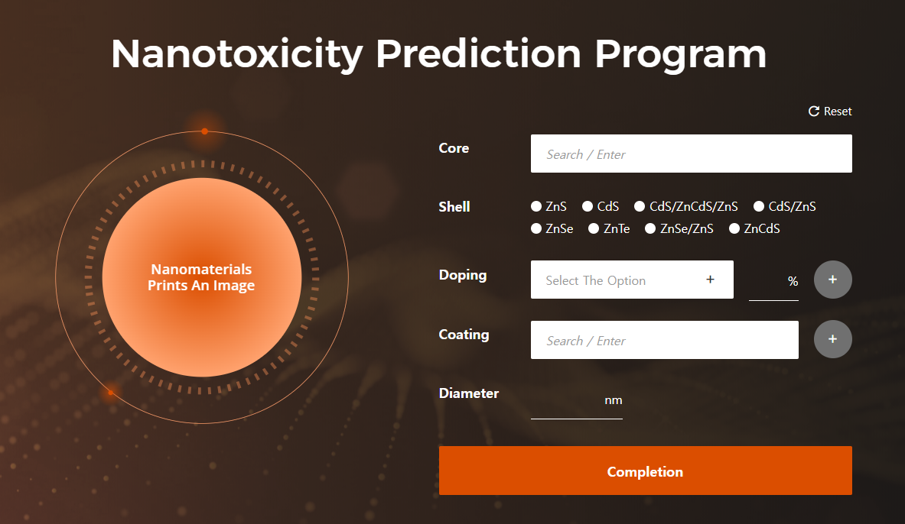
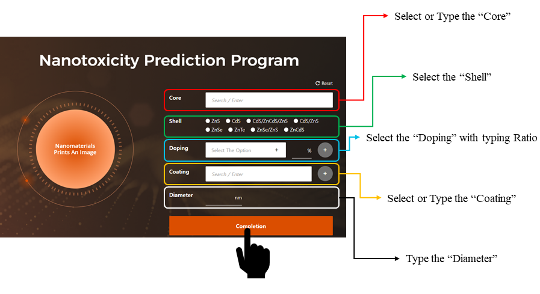
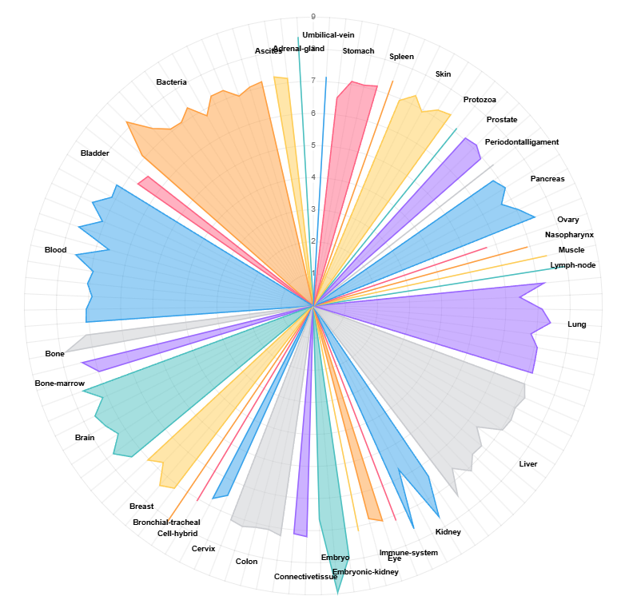

# NanoToxRadar
## Introduction
NanoToxRadar is a multi-target nano-QSAR model with improved Applicability Domain (AD) using a diverse multi-component nanoparticles (MC-NPs) dataset. This model predicts the cytotoxicity of MC-NPs across 110 different cell types.

The model employs Size-dependent Electron-Configuration Fingerprint (SDEC FP) to represent MC-NP structures[1] and one-hot encoded cell types to predict toxicities across 110 cell lines. The CatBoost regression model achieved strong predictive performance $(R^{2}_{Test} = 0.877)$ and has been deployed as a web service.

Quick Start: For immediate use via web interface, follow the "Quick Usage" section below.
Detailed Information: For comprehensive methodology and validation details, see our paper "NanoToxRadar: A multi-target nano-QSAR model for predicting the cytotoxicity of multicomponent nanoparticles" [2]

## Quick Usage (Web Service)
### Step 1 - Access the Website 
Visit ([NanoToxRadar](https://www.kitox.re.kr/nanotoxradar))


### Step 2 - Input Nanoparticle Information
Fill in the nanoparticle details following the guidelines below:


**Input Guidelines:**
- **Core**: Required field - specify the core material
- **Shell**: Optional - select from available materials if applicable
- **Coating**: Optional - add coating materials for complex structures
- **Doping**: Optional - specify doping components
- **Doping Rate (%)**: Required if doping component is specified (range: 1-100%)
- **Diameter (nm)**: Required (valid range: 1-700 nm)

**⚠️ Important**: Diameter values outside the 1-700 nm range may result in reduced prediction accuracy as the model operates outside its trained domain.

### Step 3 - Get Results
View and download your cytotoxicity predictions:



Results can be downloaded for further analysis.

## Local Usage

### Step 1 - Clone Repository
```bash
git clone https://github.com/Jaehyeon-O-Ob/NanoToxRadar.git
cd NanoToxRadar
```

### Step 2 - Create Virtual Environment
We recommend using Miniconda:
```bash
conda create -n nanotoxradar python=3.10
```

### Step 3 - Install Dependencies
```bash
conda activate nanotoxradar  # activate the environment
pip install -r requirements.txt
```

### Step 4 - Configure Nanoparticle Parameters
Open `prediction.py` and modify the nanoparticle dictionary in the '# nano particle ready' section:

```python
# nano particle ready
nanoparticle = {'Core': 'CdSe',
               'Shell': '',
               'Doping': '',
               'Doping Rate(%)': '',
               'Coating': '',
               'Diameter(nm)': 500}
```

**Parameter Guidelines:**
- **Core**: Required - specify the core material
- **Shell**: Optional - must be from the list in "shell_volume_list.csv" if provided
- **Doping**: Optional - specify doping component if applicable
- **Doping Rate(%)**: Required if doping component is specified (range: 1-100%)
- **Coating**: Optional - specify coating material
- **Diameter(nm)**: Required (valid range: 1-700 nm)

**⚠️ Important**: Diameter values outside the 1-700 nm range may result in reduced prediction accuracy as the model operates outside its trained domain.

### Step 5 - Run Prediction
Execute the script to generate predictions. Results will be saved as "result_from_model.csv".
```bash
python prediction.py
```

## References
[1] Shin et al., Use of Size-Dependent Electron Configuration Fingerprint to Develop General Prediction Models for Nanomaterials. NanoImpact 2021, 21, 100298.

[2] We will add it as soon as possible
